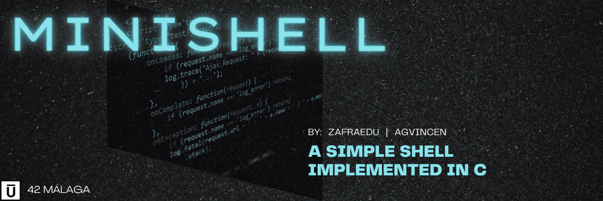

<div align="center">
	
	
	
	
	
</div>


---

<p align="center">
	<a href="#about">About</a> •
	<a href="#how-to-use">Usage</a> •
	<a href="#mandatory">Mandatory</a> •
	<a href="#norme">Norminette</a> •
	<a href="#license">License</a>
</p>

A mini recreation of bash. Implementing previously learned concepts like file descriptors and processes. Made with [Agustin Vincenti](https://github.com/vincenag).
## About

El shell es un programa que el usuario puede utilizar para interactuar con los servicios de un sistema operativo. Bash es el shell GNU y actualmente es el programa de shell más común. Tomamos el desafío de recrear bash muy literalmente, así que lo primero que hicimos fue aprender cómo funciona realmente bash con la ayuda de este artículo. Básicamente, divide el proceso en 3 pasos: lexer → parser → executor, que replicamos en nuestro proyecto.
>[Click aquí](./assets/es.subject.pdf) para ver el `subject` del proyecto.
>
>[Click aquí](./assets/EvaListES.pdf) para ver la `hoja de corrección` del proyecto.

## HOW TO USE

### Compile
1 - Instalar dependencias para minishell:
```bash
sudo apt-get install make libreadline-dev
```
2 - Clonar el repositorio:
```bash
git clone https://github.com/zafraedu/minishell.git && cd minishell
```
3 - Ejecutar el Makefile
```bash
make && make clean
```
4 - Ejecutar el programa
```
./minishell
```
### Makefile rules
- `make` - Compila los archivos ***src/push_swap*** y genera el ejecutable **push_swap**;
- `make clean` - Eliminas todos los objetos (*.o) generados al compilar;
- `make fclean` - Elimina todos los objetos más el ejecutable;
- `make re` - usa `make fclean` + `make`;


## Mandatory

<table>
  <tr>
    <th>Nombre del programa</th>
    <td><i>minishell</i></td>
  </tr>
  <tr>
    <th>Archivos a entregar</th>
    <td>Makefile, <code>*.h</code>, <code>*.c</code> </td>
  </tr>
  <tr>
	<th>Argumentos</th>
	<td></td>
  </tr>
  <tr>
    <th>Makefile</th>
    <td><i>NAME</i>, <i>all</i>, <i>clean</i>, <i>fclean</i>, <i>re</i></td>
  </tr>
  <tr>
    <th>Elementos autorizados</th>
    <td><code>readline()</code>, <code>rl_clear_history()</code>, <code>rl_on_new_line()</code>, <code>rl_replace_line()</code>, <code>rl_redisplay()</code>, <code>add_history()</code>, <code>printf()</code>, <code>malloc()</code>, <code>free()</code>, <code>write()    </code>, <code>access()</code>, <code>open()</code>, <code>read()</code>, <code>close()</code>, <code>fork()</code>, <code>wait()</code>, <code>waitpid()</code>, <code>wait3/4()</code>, <code>signal()</code>, <code>sigaction()</code>, <code>kill()</code>, <code>exit()</code>, <code>getcwd()</code>, <code>chdir()</code>, <code>f/l/stat()</code>, <code>unlink()</code>, <code>execve()</code>, <code>dup/2()</code>, <code>pipe()</code>, <code>opendir()</code>, <code>readdir()</code>, <code>closedir()</code>, <code>strerror()</code>, <code>perror()</code>, <code>isatty()</code>, <code>ttyname()</code>, <code>ttyslot()</code>, <code>ioctl()</code>, <code>getenv()</code>, <code>tcsetattr()</code>, <code>tcgetattr()</code>, <code>execve()</code>, <code>tgetent()</code>, <code>tgetflag()</code><code>tgetnum()</code>, <code>tgetstr()</code>, <code>tgoto()</code>, <code>tputs()</code></td>
  </tr>
  <tr>
    <th>¿Libft permitido?</th>
    <td>SI</td>
  </tr>
  <tr>
    <th>Descripción</th>
    <td>Escribe un shell</td>
  </tr>
</table>

Este fue probablemente el proyecto más grande que he hecho hasta ahora, así como el primero que hice en grupo.
El objetivo era crear una versión mini de bash, digo mini pero aún así era un proyecto enorme. Tuvimos que aprende
cómo bash toma argumentos, los analiza y los ejecuta. Tuvimos que incorporar las siguientes características:
- Mostrar **una entrada** mientras espera un comando nuevo
- Tener un **historial funcional**.
- Buscar y ejecutar el ejecutable correcto (basado en la variable ***PATH*** o mediante el uso de rutas relativas o absolutas).
- Evita utilizar más de **una variable global** para indicar la recepción de una señal. Piensa en lo que implica: Esta aproximación evita que tu gestor de señales acceda a tus estructuras de datos principales.
- No interpretar comillas sin cerrar o caracteres especiales no especificados en el enunciado como \ (barra invertida) o ; (punto y coma).
- Gestionar que la ’ evite que el shell interprete los metacaracteres en la secuencia entrecomillada.
- Gestionar que la " evite que el shell interprete los metacaracteres en la secuencia entrecomillada exceptuando $ (signo de dólar).
- Implementar **redirecciones**:
  - '<' debe redirigir input.
  - '>' debe redirigir output.
  - “<<” debe recibir un delimitador, después leer del input de la fuente actual hasta que una línea que contenga solo el delimitador aparezca. Sin embargo, no necesita actualizar el historial.
  - “>>” debe redirigir el output en modo append.
- Implementar **pipes** (carácter |). El output de cada comando en la pipeline se conecta a través de un pipe al input del siguiente comando.
- Gestionar las **variables de entorno** ($ seguidos de caracteres) que deberán expandirse a sus valores.
- Gestionar $?, que deberá expandirse al estado de salida del comando más reciente ejecutado en la pipeline.
- Gestionar `ctrl-C` `ctrl-D` `ctrl-\`, que deberán funcionar como en bash.
- Cuando sea interactivo:
  - `ctrl-C` imprime una nueva entrada en una línea nueva.
  - `ctrl-D` termina el shell.
  - `ctrl-\` no hace nada.
- Deberá implementar los *built-ins*:
  - `echo` con la opción `-n`.
  - `cd` solo con una ruta relativa o absoluta.
  - `pwd` pwd sin opciones.
  - `export` sin opciones.
  - `unset` sin opciones.
  - `env` sin opciones o argumentos.
  - `exit` sin opciones.
> **note:**
> La función readline puede producir algunos leaks que no necesitas arreglar.
> Eso no significa que tu código, sí, el código que has escrito, pueda producir leaks.

## NORME
En 42 School, se espera que casi todos los proyectos se escriban de acuerdo con la Norma, que es el estándar de codificación de la escuela.
```
- No for, do...while, switch, case, goto, ternary operators and variable-length arrays are allowed
- Each function must be a maximum of 25 lines, not counting the function's curly brackets
- Each line must be at most 80 columns wide, comments included
- A function can take 4 named parameters maximum
- No assigns and declarations in the same line (unless static)
- You can't declare more than 5 variables per function
- ...
```
[42 NORMA](https://github.com/zafraedu/42/blob/master/public/es_norm.pdf) información sobre las normas de código de 42. `PDF`


## LICENSE
Este trabajo se publica bajo los términos de [42 Unlicense](https://github.com/zafraedu/minishell/blob/main/LICENSE).
